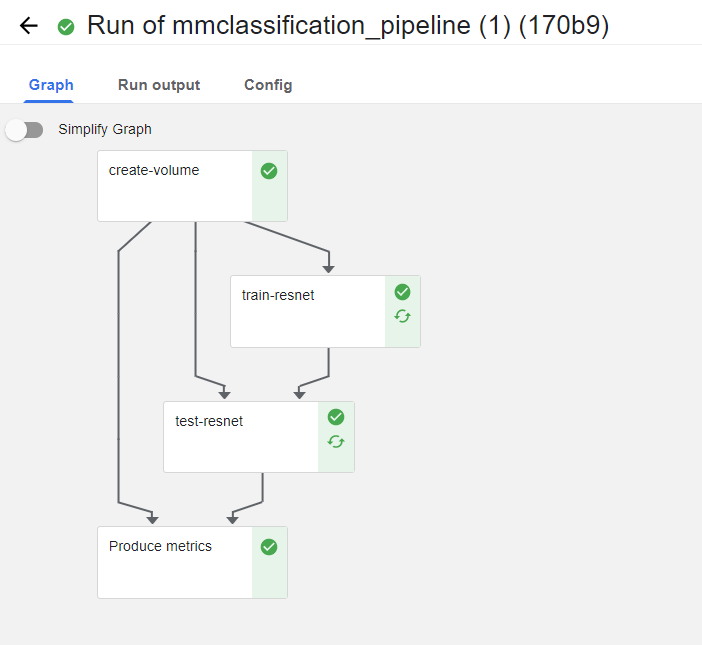

# Kubeflow-pipeline 맛보기

## Concepts

Kubeflow에서 제공하는 ML operation container orchestration 솔루션이다. 다음과 같은 주요 컨셉을 가지고 있다.

### Pipeline

ML 워크플로에 대한 명세로, 1개 이상의 component로 구성이 된다. 각 컴포넌트를 노드로 하는 graph로 표현이 가능하며, 각 컴포넌트는 pod으로 실행이 된다. Python SDK를 이용해서 파이썬 스크립트를 통해 파이프라인을 작성 및 컴파일 할 수 있다. 컴파일된 파이프라인은 Pipeline UI 혹은 Python SDK를 통해 업로드 및 실행이 가능하다.

### Component

Pipeline의 구성 요소로, 데이터 전처리, 변환, 모델 학습 등 ML 워크플로상 하나의 스텝을 수행한다. 함수처럼 입출력을 명세할 수 있는데, 다른 컴포넌트의 출력을 입력으로 받거나, 해당 컴포넌트의 출력을 다른 컴포넌트의 입력으로 전달할 수 있다. 컴포넌트에서 수행되는 코드는 모두 docker image로 패키징 되어야 한다. Python SDK (kfp)를 통해서 다음과 같은 세 가지 방법으로 컴포넌트를 작성할 수 있다. [문서](https://www.kubeflow.org/docs/components/pipelines/v2/author-a-pipeline/components/#1-lighweight-python-function-based-components)의 내용을 간략히 요약한 것이다.

1. Lighweight Python function-based components
파이썬 함수를 작성하고 이를 `kfp.dsl.component` 데코레이터를 사용하는 등의 방법으로 컴포넌트로 만들 수 있다. 이 경우 해당 함수 안에 실행에 필요한 모든 코드가 들어있어야 한다. 즉, 함수 안에 라이브러리 임포트가 들어가야 하고, 함수 외부에 작성된 다른 함수를 사용하면 안된다. 이 때문에 프로토타이핑 용으로 간단하게 사용하기엔 좋지만, 프로덕션 레벨에서는 활용하기가 힘들다.

2. Containerized Python components

1번이 확장된 형태이다. 여전히 파이썬 함수를 컴포넌트로 만들어주지만, 해당 함수 뿐만이 아니라, 함수가 속한 파이선 모듈 전체를 카피해서 컨테이너 이미지에 포함한다.
즉, 해당 디렉토리의 파이썬 프로젝트 코드를 모두 사용하다는 의미다. `kfp.dsl.component` 데코레이터를 사용할 때, target_image 아규먼트를 설정하면 된다.

3. Custom container components

이미 도커 이미지로 빌드된 코드를 레버리지 할 수도 있다. `kfp.dsl.ContainerSpec` (혹은 `kfp.dls.ContainerOp`)을 통해서 실행할 이미지와 커맨드, 아규먼트 등을 지정하여 해당 이미지를 활용해 컨테이너를 실행할 수 있다.

### Graph

Kubeflow Pipeline UI 상으로 파이프라인의 런타임 실행을 도식화 한 것으로, 각 컴포넌트의 parent, child 관계를 나타낸다.

### Experiment

pipeline을 여러번 실행할 수 있다. 이 때 각 실행을 run이라 부르며, experiment는 이를 관리하기 위한 workspace 개념이다.

## Toyproject - mmclassification

single GPU 머신에서 돌 수 있는 ML pipeline을 작성해보았다. [mmclassification](https://github.com/open-mmlab/mmclassification) 의 resnet18 / cifar10 을 트레이닝하고, 테스트 셋 accuracy를 측정하고 이를 Metric으로 남기는 pipeline이다. (kfp: 1.8.14)

### 도커 이미지 작성

mmclassification에서 따로 도커 이미지를 릴리즈 하고 있는 것 같아 보이지는 않았다. 따라서 프로젝트의 [Dockerfile](https://github.com/open-mmlab/mmclassification/blob/master/docker/Dockerfile)을 사용하여 로컬에서 직접 빌드했다.
별도 레포지토리에 도커 이미지를 푸시를 하진 않았고, pipeline configuration 설정을 통해 `image_pull_policy`를 `IfNotPresent`로 세팅해두었다.

### `kfp`를 이용한 컴포넌트 및 파이프라인 작성.

[fashion mnist 예제 코드](https://github.com/manceps/fashion-mnist-kfp-lab/blob/master/KF_Fashion_MNIST.ipynb)를 참조하여 [mmclf-kubeflow-pipeline.py](./mmclf-kubeflow-pipeline.py) 코드를 작성하였다. 그래프 형태는 아래와 같다.

1. `create-volume`: 여러 컴포넌트들이 모델 파일 등이 저장된 디렉토리를 공유할 수 있도록 `kfp.dsl.VolumeOp`을 사용해서 ReadWriteMany 엑세스 모드의 PVC를 생성했다.
2. `train-resnet`:  resnet18 / cifar10 을 트레이닝 한다. 트레이닝 로그, 체크포인트 파일 등을 1에서 생성한 볼륨에 저장한다.
3. `test-resnet`: 트레이닝 완료된 모델의 testset accuracy를 측정한다. 이 때 공유 볼륨에 저장된 latest.pth 체크포인트를 사용하며, 평가 결과를 공유 볼륨에 `eval_result.json` 이란 이름으로 저장한다.
4. `Produce metrics`: 3번에서 저장한 json 파일을 읽어 metric report에 적절한 형태로 가공하여 이를 별도 json 파일로 덤프한다.
    - UI단에서 metrics를 렌더링하기 위해서는 `MLPipeline Metrics` 라는 이름의 Output 아티팩트를 생성하면 된다.
    - 이를 위한 간단한 방법으로, `Lightweight python component`를 작성할 때 함수의 아규먼트에 metric json 출력 경로를 `OutputPath('Metrics)` 라는 타입 어노테이션으로 작성해주면 된다.

### Troubleshooting

`create-volume` 스텝에서 생성한 pvc가 unbound되어 `train-resnet` 스텝이 실행되지 않는 현상이 있었다. [setup 섹션](../01-setup/on-premise-kubeflow-setup.md)에서 소개했듯이, kubeflow를 single-node 의 on-premise kubernetes 환경에서 셋업해두었다. 이 때 pvc에 대한 동적 pv provisioning을 위해 default storage class에서 [local-path-provisioner](https://github.com/rancher/local-path-provisioner)를 사용하게 설정했다. local-path의 경우 ReadWriteMany 옵션을 지원하지 않는다. 이유는 간단한데, 지금 나의 경우에야 단일 노드를 사용하고 있지만, multi-node 환경에서는 서로 다른 pod이 서로 다른 node에서 실행될 경우 local-path 볼륨을 공유할 수 없는 경우가 발생한다. 이 떄문에 on-prem kubernetes 클러스터 환경에서는 보통 nfs를 셋업하고, nfs-provisioner를 사용하여 동적으로 PV를 생성한다. on-prem 클러스터 관리를 위해서는 굉장히 중요한 부분이지만, 일단 파이프라인 실행을 위해 수동으로 RWX 옵션의 PV를 생성하고 PVC를 수정하여 이 PV에 수동으로 연결해주었다.
