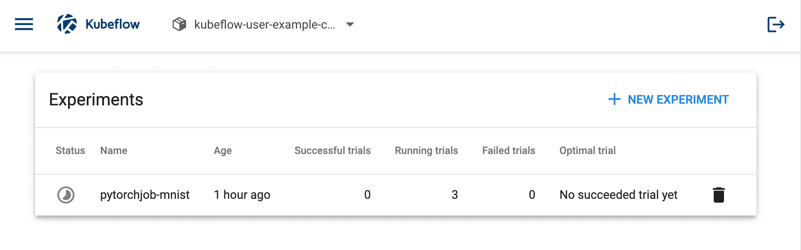
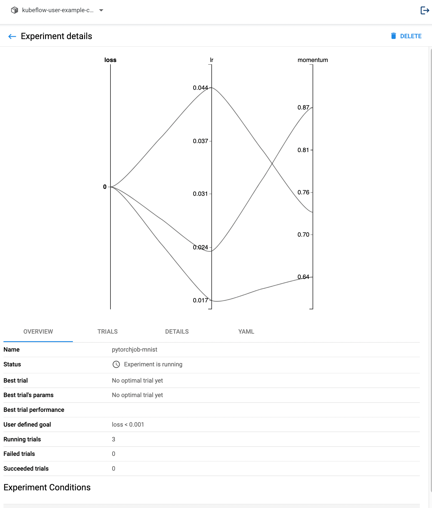
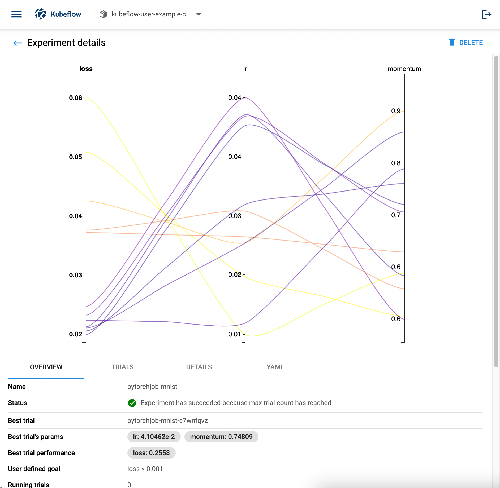

# Running mnist-pytorch in Katib

## Overview
Katib는 hyper parameter tuning을 쉽게 돌릴 수 있게 하는 Kubeflow 컴포넌트 중 하나이다.
예제 experiment를 하나 돌려보면 핵심 기능들을 파악하기 좋을 것 같아서 예시를 찾아보았다.
다행히 셋업 방법, 실행 예제 등이 [공식 문서](https://www.kubeflow.org/docs/components/katib/hyperparameter/)에 잘 나와있었다.
Setup 관련 문서는 standalone 기준으로 작성되어 있고, Kubeflow를 이미 셋업 했다면 Katib가 포함되어 있기 때문에 스킵하면 된다.
소개되어 있는 HPO 예시는 Mxnet 기반이라 이왕 하는 김에 PyTorch 예시가 좋을 것 같아서 다른 곳에서 찾아서 실행해봤다.
Katib의 개요에 대해서 살펴보기 위해 한 번쯤 위 공식 문서를 정독하는 것도 좋을 것 같다.

## PyTorch-MNIST HPO using Katib
생각보다 쉽게 [yaml 파일](https://github.com/kubeflow/katib/blob/master/examples/v1beta1/kubeflow-training-operator/pytorchjob-mnist.yaml)을 찾을 수 있었다.
[공식 문서](https://www.kubeflow.org/docs/components/katib/hyperparameter/)에 나온대로 `namespace` 값만 `kubeflow-user-example-com`으로 바꾸고 `kubectl apply -f pytorchjob-mnist.yaml`로 실행했다.
예상과 달리 한번에 실행 성공.. 하는듯 싶었다.


Job을 클릭하면 꽤나 직관적인 그래프와 함께 trial들에 대한 summary를 볼 수 있는듯 하다.


하지만, 예전에 PyTorchJob을 시도했던 때와 동일한 이유로 worker에서 에러가 나는 것 같아 보인다.
아직 좀 더 디버깅 해봐야겠지만, Katib에서 PyTorchJob을 쓰기 때문에 이 문제를 더이상 피할 수 없을 것 같다.
그래도 처음에 PyTorchJob을 접했을 때 Katib를 써서 HPO를 하게 된다면 PyTorchJob을 이용해서 (분산) 학습을 쉽게 하는 방향일 것 같다고 생각했는데 그게 맞아서 나름 다행(?)이다.

## Katib Experiment Configuration
위에서 실행한 yaml 파일의 내용을 살펴보면서 Katib 관련 configuration들을 파악해보자.
관련 내용은 [공식 문서](https://www.kubeflow.org/docs/components/katib/experiment/)를 참조했다.

Katib를 이용해 NAS나 HPO 실험을 돌리기 위해서 YAML 설정파일을 작성해야 한다.
이 설정 파일에는 최적화 할 parameter들의 search space를 정의하고, 최적화 알고리즘이나 metric 등을 명시할 수 있다.
기본적으로 k8s에서 사용하는 YAML 파일과 매우 유사한 구조를 띄고 있고, `spec`의 value에 실험과 관련된 다양한 필드들을 지정하게 된다.

pytorch-mnist 예시에 나와있는 대표적인 필드들을 정리해보자면 아래와 같다:
### `parameters`
최적화 할 hyperparameter의 범위를 명시할 수 있다. 이 필드가 곧 search space를 정의하는 것이고, `feasibleSpace` 필드에 min, max, step 혹은 list를 이용해서 가능한 값들을 명시할 수 있다.
여기에 명시된 값들을 잘 조합해 여러번 학습을 시켜보면서 최적의 hyperparameter 조합을 찾게 된다.
```yaml
parameters:
  - name: lr
    parameterType: double
    feasibleSpace:
      min: "0.01"
      max: "0.05"
      step: "0.01"
  - name: momentum
    parameterType: double
    feasibleSpace:
      list: ["0.5", "0.6", "0.7"]
```

#### `objective`:
최적화 기준이 되는 metric을 명시하는 필드이다. 가장 흔히는 학습하는 모델의 정확도를 사용한다. 명시한 metric을 최소화할지, 최대화할지 `type` 필드에 `min`이나 `max`로 지정할 수 있다. `objectMetricName`을 이용해서 metric에 이름을 붙일 수 있고, `goal`에 명시된 값에 도달하면 더이상 trial을 진행하지 않고 멈추게 된다. `goal`이 명시되어 있지 않으면 `maxTrialCount`만큼만 trial을 진행하게 된다.
```yaml
objective:
  type: minimize
  goal: 0.001
  objectiveMetricName: loss
```
### `parallelTrialCount`:
병렬적으로 실행할 hyperparameter set의 갯수. (default: 3)

### `maxTrialCount`
최대 수행할 trial 갯수이다. 이 숫자만큼 hyperparameter set을 생성하고, 이를 실행한다. 만약 이 필드가 정의되어 있지 않다면, `objective.goal`에 도달할 때까지, 혹은 `maxFailedTrialCount`에 도달할 때까지 진행된다.

### `maxFailedTrialCount`
실패할 수 있는 최대 trial의 갯수이다. 만약 이 값에 도달해서 experiment가 멈춘다면, experiment의 status는 `Failed` 상태로 기록된다.

### `algorithm`
Katib에서 지원하는 search algorithm들을 명시할 수 있는 필드이다. 현재까지 지원되는 알고리즘들은 [여기](https://www.kubeflow.org/docs/components/katib/experiment/#search-algorithms-in-detail)에서 찾을 수 있다.
```yaml
algorithm:
  algorithmName: random
```
### `trialTemplate`
Trial에 대한 정의가 담긴 template을 정의한다. 이 부분에서 정의해야 할 것들이 꽤 된다.  우선 ML training 코드가 Docker image 형태로 존재해야 한다. `trialTemplate.trialParameters`를 설정하면, 해당 parameter 값을 `trialTemplate.trialSpec` 내에서 사용할 수 있다. 아래 예시를 보면 cmd args로 사용한 것을 볼 수 있다. `trialTemplate.trialSpec`은, Kubeflow에서 지원하는 `PytorchJob`, `TFJob` 등의 operator를 사용하면 된다. [PyTorch Training Operator 예시](https://github.com/kubeflow/training-operator/blob/master/examples/pytorch/simple.yaml)와 아래 `trialTemplate.trialSpec`을 비교해보면 `metadata` 부분 빼고 매우 유사한 것을 볼 수 있다. 이렇게 정의된 Job들이 여러 hyperparameter set으로 여러개 돌아가는 형태이다.

```yaml
trialTemplate:
    primaryContainerName: pytorch
    trialParameters:
      - name: learningRate
        description: Learning rate for the training model
        reference: lr
      - name: momentum
        description: Momentum for the training model
        reference: momentum
    trialSpec:
      apiVersion: kubeflow.org/v1
      kind: PyTorchJob
      spec:
        pytorchReplicaSpecs:
          Master:
            replicas: 1
            restartPolicy: OnFailure
            template:
              spec:
                containers:
                  - name: pytorch
                    image: docker.io/kubeflowkatib/pytorch-mnist-cpu:latest
                    command:
                      - "python3"
                      - "/opt/pytorch-mnist/mnist.py"
                      - "--epochs=1"
                      - "--batch-size=16"
                      - "--lr=${trialParameters.learningRate}"
                      - "--momentum=${trialParameters.momentum}"
          Worker:
            replicas: 1
            restartPolicy: OnFailure
            template:
              spec:
                containers:
                  - name: pytorch
                    image: docker.io/kubeflowkatib/pytorch-mnist-cpu:latest
                    command:
                      - "python3"
                      - "/opt/pytorch-mnist/mnist.py"
                      - "--epochs=1"
                      - "--batch-size=16"
                      - "--lr=${trialParameters.learningRate}"
                      - "--momentum=${trialParameters.momentum}"
```

## Retrospect
처음에 Katib UI 상으로는 Trial이 계속 running 상태여서 잘 돌아가는 줄 알았는데 몇시간이 지나서도 안 도는 걸 보고 뭔가 이상하다 싶었다.
역시나 원래 PyTorchJob 돌릴 때 발생했던 에러가 똑같이 발생한 것 같다.
아직은 시간을 더 쏟아서 PyTorchJob을 살펴봐야겠지만.. 잘 돌아가기만 한다면 HPO 실험에 꽤 유용할 것 같다는 생각이 든다.


***
## Debugging PyTorchJob

### Manual Trials
* 우선 첫 step 으로 매뉴얼하게 두 프로세스를 각각 RANK을 설정해줘서 돌렸을 때 잘 되는지 확인해봤다. 아무 문제없이 잘 돌아간 것을 확인. 하나의 GPU을 공유했는데도 아무런 문제가 없었다.
* `PytorchJob` 대신 Kubernetes `Job`을 이용해서 두개의 Pod를 따로 띄워서 확인. 처음에는 하나의 Pod에 여러개의 컨테이너를 띄워서 `localhost`를 `MASTER_ADDR`로 설정했다. 문제없는 것 확인. 그 다음에는 두개의 서로 다른 Pod를 띄웠는데, 이 때는 매뉴얼하게 master Pod의 IP 주소를 `MASTER_ADDR`로 설정하고 worker Pod를 띄웠음. 문제 없이 잘 돌아가는 것 확인.
* Service를 master Pod에 연결 시켜서 한번에 두개의 Pod를 worker와 master로 띄워서 확인. 문제 없이 잘 돌아갔다.

-> 위 디버깅 과정에서 일단 Pod 끼리 통신하는 것에 문제가 머신이나 Minikube 설정과는 관련이 없다는 것을 유추할 수 있었다.
-> 따라서 남은 것은 Service와 연결되어 있는 `istio` 디버깅이었는데, 검색해보니 관련 내용을 비교적 쉽게 찾을 수 있었다.

### Connection reset issue in `istio`
> Related Github Issue: https://github.com/kubeflow/pytorch-operator/issues/258

올라온지 좀 지난 이슈이긴 하지만, `PytorchJob` 사용 시 같은 현상을 겪고 있는 이슈를 발견했다.
Worker에서 process group을 생성하려고 할 때 `Connection reset by peer` 에러로 실패하는 경우이다.
결론은 istio-injection이 켜져 있는 경우에 (즉 istio sidecar Pod가 띄워지는 상황에) 이런 상황이 발생할 수 있다는 것이다.

### istio-injection?
istio-injection은 Pod를 띄울 때 각 Pod 마다 istio sidecar를 inject 하는 것을 의미한다.
istio sidecar가 일종의 네트워크 proxy처럼 동작하면서 security나 observation 등 istio가 제공하는 기능들을 사용할 수 있다.
istio-injection이 disable 된 상태에서는 어떤 Pod이든 간에 PyTorchJob Pod를 이름으로 접근 할 수 있다고 한다.
단순히 Service의 기능을 하는 것이다.
istio sidecar가 어떤 security 기능을 추가했는지는 아직 확인해보지 못했지만 이 경우 접근에 제약이 생기는 것은 분명한 것 같다.
과거 Github Issue 들을 살펴봐도 istio 설정 관련 솔루션이 나와있는 것이 아니라 단순히 istio를 disable 시키는 것을 보면 단순한 문제는 아닌가보다(?)

아래는 디버깅 후 돌려본 Katib job. 성공적으로 모든 trial들을 완료하고 best parameter를 찾을 수 있었다.
